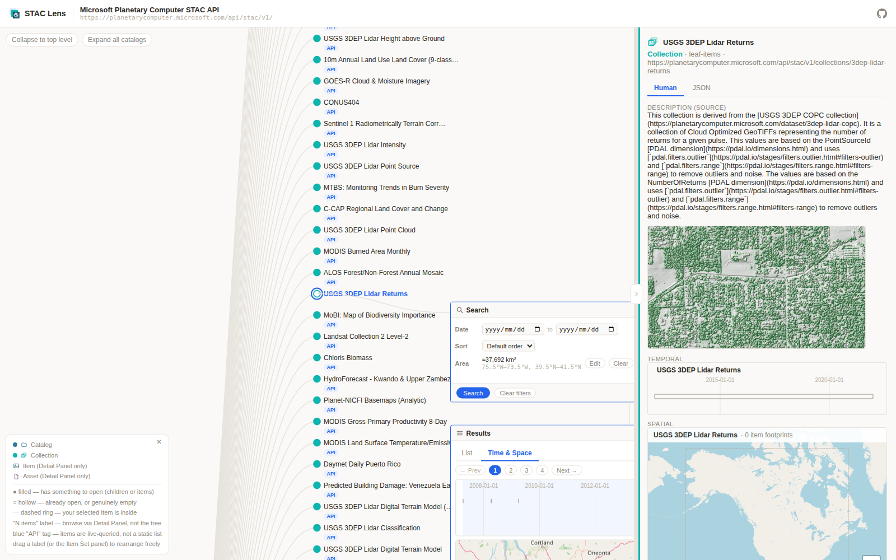
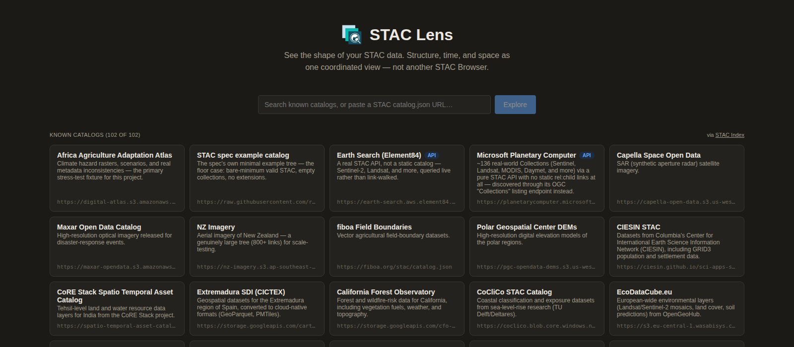

<p align="center">
  
</p>

<h1 align="center">STAC Lens</h1>

<p align="center">
  See the shape of your STAC data — structure, time, and space as one coordinated view.
</p>

<p align="center">
  <strong><a href="https://staclens.com">staclens.com</a></strong>
</p>

<p align="center">
  <a href="LICENSE"></a>
  
  
</p>

<p align="center">
  
</p>

STAC Lens is a client-side lens on [STAC](https://stacspec.org/) (SpatioTemporal Asset Catalog) catalogs and APIs. Point it at any catalog and it shows three things a field-by-field browser doesn't: the **shape** of the dataset (how the publisher actually organized it — deep, flat, wide), its **health** (where the metadata contradicts itself or the spec), and its **distance from the specification** (what an API declares it supports versus what it really does when asked). Structure, time, and space are coordinated views of the same data: select a node in one and the others follow.

On the site: [About](https://staclens.com/about/) (also [中文](https://staclens.com/zh/about/)) · [Health rules](https://staclens.com/health-rules/) · [Public STAC catalogs](https://staclens.com/catalogs/) · [Deploying](https://staclens.com/deploy/) — the same documents as this repository's `docs/`, published as pages.

### Who it's for

- **People choosing a data source** — see how a catalog is organized, what it covers in time and space, and whether its API behaves, before writing a line of code against it. The landing page's 100+ catalogs are each verified to be live, real STAC, and reachable from a browser.
- **Publishers checking their own catalog** — a picture of the structure you shipped, with the problems marked: two disjoint spatial extents, a `rel:collection` that disagrees with `rel:parent`, deprecated license values, a root with 400 collections and no hierarchy, an API that returns the wrong page for a filtered query. Schema validators check the JSON; this checks what the JSON *does*.
- **People learning STAC** — the Catalog → Collection → Item model, extents, links, and API capabilities as one visual language rather than a set of documents.
- **The STAC community** — an empirical view of conformance in the wild. Everything the app has learned about real servers is written down in [`docs/DESIGN.md`](docs/DESIGN.md), with the requests that established it.

### How it relates to STAC Browser

[STAC Browser](https://github.com/radiantearth/stac-browser) is the reference browser and it does its job well; STAC Lens is not a replacement for it and is not trying to become one.

| | STAC Browser | STAC Lens |
|---|---|---|
| Purpose | Read a catalog: every object, every field, faithfully | Understand a catalog: its shape, health, and real behavior |
| Deployment | One instance per catalog, configured by its publisher | One instance, any catalog — paste a URL |
| Unit of view | The current object (a page per Catalog / Collection / Item) | The whole graph, with time and space alongside it |
| Server behavior | Trusts the server | Exercises the server and reports what it actually does |
| Metadata problems | Renders what's there | Flags contradictions and deprecated forms, never silently resolves them |
| Item browsing | Complete | Deliberately sufficient — lists, pages, a timeline and a map |

If you publish a catalog and want visitors to read it, deploy STAC Browser. If you want to see what a catalog *is* — yours or anyone's — open it in STAC Lens.

[`docs/ARCHITECTURE.md`](docs/ARCHITECTURE.md) is the map of the code as it is today; [`docs/DESIGN.md`](docs/DESIGN.md) is the log of why — research notes, bug post-mortems, and every decision including the reversed ones.

## Highlights

**Structure Lens** — a horizontal, curved node-link tree over the Catalog → Collection graph. Items are never tree nodes: a Collection with two million Items is one leaf, not a wall. Nothing loads until you expand it; the canvas pans and zooms by direct manipulation (drag, wheel), and nodes and panels can be rearranged by hand. Selecting an Item highlights the Collection it belongs to with a dashed ring, distinct from the solid ring of a direct selection.

**Item Set, embedded in the tree** — selecting a Collection opens its Items right at that node, in window-style panels (title bar as drag handle, corner resize) rather than in a separate page. Static catalogs and API-backed Collections get genuinely different UI, because they are different things:

- A static catalog's Item list is known up front, so it gets **real numbered pagination** with a per-page cache.
- An API-backed Collection gets two independent, connected boxes: a **Search** box (date range, an area drawn on a real map, sort where the API declares support) feeding a **Results** box that presents the cursor's accumulated buffer as numbered pages. API mode is **search-first** — nothing is fetched until you ask.

Both share a **List / Time & Space** switcher: the same page of Items as a scrollable list, or as a zoomable timeline stacked over an interactive map. Already-visited pages stay faintly visible behind the current one.

**Inspector** — one panel per selected object, with a colored identity (Catalog / Collection / Item) that matches the tree. A **Human** tab renders facts as their natural UI — the temporal extent as a timeline, the spatial extent as a map, extensions (`eo`, `view`, `proj`, `sat`, `sar`, `sci`, `processing`, `grid`, `s2`, …) as readable rows — and a **JSON** tab shows the untouched source. Every derived field is labeled as derived; a field that isn't in the source isn't shown. Where sources contradict themselves (a `rel:collection` that disagrees with `rel:parent`, two spatial bboxes where STAC 1.1 allows one meaning) the contradiction is surfaced, not resolved silently.

**Shareable URLs** — the address bar always encodes what you're looking at: `#<absolute STAC href>`, plus an applied API search as `?datetime=…&bbox=…&sortby=…` using STAC's own parameter names. Paste the link anywhere and it reopens the same catalog, selection, and search. Browser Back/Forward move between catalogs and the landing page, not out of the app. On a phone the same link opens a compact view — the catalog as a document outline with each Collection's Items listed under it ten at a time, the Inspector as a bottom sheet — with a one-line pointer to the full experience on a desktop browser.

**Landing page** — one large field, two jobs: type a name, topic or place to filter the list live, or paste any STAC Catalog, Collection or API URL and open it. Below it, a faceted browser over 100+ verified public catalogs and APIs — sidebar facets (topic, region, publisher, static/API) over an editorial tag vocabulary of our own, since neither STAC nor STAC Index classifies catalogs — with each card carrying its tags; favorites and recently opened catalogs are remembered in your browser.

<p align="center">
  
</p>

## STAC support

STAC Lens reads STAC 1.0 and 1.1 static catalogs and STAC APIs, and follows the specifications rather than any one server's habits:

| Area | What is supported |
|---|---|
| Static catalogs | `rel:child` / `rel:item` traversal; relative links resolved against the document URL (self-contained, relative-published and absolute catalogs) |
| STAC API - Core | capabilities read from the landing page's `conformsTo`; UI controls appear only when the server declares the class they need |
| STAC API - Features | `rel:items`, `/collections` listing (`rel:data`) for roots without `child` links |
| STAC API - Item Search | `GET /search` scoped with `collections=`, `bbox`, `datetime`; Sort extension when declared |
| Pagination | `next` links followed exactly as advertised — `href`, and the spec's `method` / `headers` / `body` / `merge` (POST-paginating servers included); `context` and `numberMatched` both understood, a total count never assumed |
| Children extension | `rel:children` → `/children`, preferred over one fetch per `child` link when a server offers it |
| STAC 1.1 | common `bands` / `data_type` (with `raster:bands` fallback), Link `method`/`body`, deprecated `license` values flagged in the Inspector |
| Spatial extents | every declared `extent.spatial.bbox` drawn (not only the first); the spec's overall-extent rule checked and its two-bbox case flagged; malformed bboxes dropped |
| Solar System extension | `ssys:targets` / `ssys:target_class` read on Catalogs, Collections and Items and resolved up the parent chain; a non-Earth body's extents are drawn on a plain lon/lat graticule with the body named, never on Earth tiles (Rosetta's comet 67P, Cassini's Titan) |
| Real-world behavior | verified against live servers — Earth Search, Microsoft Planetary Computer, Copernicus Data Space, NASA CMR and others — and worked around only where a server contradicts the spec (documented in `docs/DESIGN.md`) |

Not yet: CQL2 filtering and free-text search, arbitrary-field sort, `overview`/`visual` asset rendering, authenticated APIs, and in-browser COG display. The current list is kept in the last section of `docs/DESIGN.md`.

What "health" means here is not a score but a list of rules, each cited to the STAC spec, its best-practices document, the community linters (`stac-check`, `stac-api-validator`) or a verified observation against a live server, and tiered as *invalid* / *warning* / *behavior* / *observation*. The full list, with what is built and what isn't, is [`docs/HEALTH-RULES.md`](docs/HEALTH-RULES.md).

## Principles

- **Never enumerate what can't be enumerated.** A 51-million-Item collection is browsed through the API's own cursor, one page at a time. There is no "load everything".
- **Never invent structure.** The tree shows the hierarchy the publisher made — flat where it is flat. No client-side grouping, no synthetic nodes, no counts the source didn't give.
- **Show a failure as a failure.** A rejected request is an error message with the server's own words, never an empty result.
- **Direct manipulation over controls.** Drag to pan, wheel to zoom, drag a divider to resize; windows have title bars; the map pans by default and draws only when a tool is armed.
- **Conformance-gated UI.** A control that depends on a server capability exists only when the server declares it.

## Getting started

```bash
npm install
npm run dev              # Vite dev server on http://localhost:5173 (add --host to expose on your LAN)
npm run build            # tsc -b && vite build → dist/
npm run lint             # oxlint
npm test                 # unit tests for the data layer
npm run test:e2e         # offline browser smoke test (recorded responses, no live servers)
npm run verify:fixtures  # headless data-layer check against two reference catalogs
npm run verify:catalogs  # re-check every landing-page catalog against its live server (docs/CATALOGS.md)
```

Requires Node 20.19+ or 22.12+ (Vite 8's own range).

## Deploying

A static site with no backend — every STAC request goes from the visitor's browser to the catalog they open. Any static host works: build with `npm run build`, publish `dist`. Routing is hash-based, so no rewrite rules are needed.

- **Any static host:** the two values above. Serve over HTTPS (browsers block `http://` catalogs from an HTTPS page).
- **Docker:** `docker build -t stac-lens . && docker run -p 8080:8080 stac-lens` — unprivileged nginx serving the build, with the same cache and content-type headers as the hosted site.
- **Sub-path or GitHub Pages:** `VITE_BASE=/<repo>/ npm run build`.
- **Netlify:** how [staclens.com](https://staclens.com) is deployed; [`netlify.toml`](netlify.toml) holds that one host's settings.

Details, headers and a GitHub Pages workflow: [`docs/DEPLOY.md`](docs/DEPLOY.md).

## Stack

TypeScript, React 19, Vite 8. `zustand` for shared state; `d3-hierarchy` / `d3-shape` / `d3-zoom` / `d3-drag` / `d3-scale` for layout math and gesture composition (rendering is plain React + SVG); `leaflet` with OpenStreetMap tiles for maps. No UI component library — a small design-token layer (`src/design/tokens.css`) with light and dark themes. The three hierarchy colors are the STAC logo's own three squares — Catalog `#C4E2EF`, Collection `#0EB4AE`, Item `#144E63` — used as hues with per-theme luminance so each reads on both surfaces; the same squares, under a lens, are the app's mark.

## Project layout

```
src/
  stac/            framework-agnostic data layer
    types.ts         StacNode, TemporalShape, node-shape classification
    graph.ts         raw STAC JSON -> StacNode, link resolution/dedup; reads STAC 1.1 bands/data_type
                     as well as 1.0 raster:bands, keeps every declared Collection bbox
    loader.ts        href-keyed cache + in-flight dedup, lazy child/item fetch
    loaderInstance.ts shared StacLoader singleton
    temporal.ts      instant/interval normalization, temporal bounds for layout
    spatial.ts       bbox/geometry normalization, bbox validation and containment (overall-extent rule)
    namespaces.ts    known-extension-prefix registry, per-scope namespace scanning
    describe.ts      plain-text temporal rendering, approximate-area / hemisphere-labeled bbox text
    extensionFacts.ts standard-extension + Common Metadata human-readable interpreters
    itemSetSummary.ts common declared-extensions/namespaces across a set of Items
    apiSearch.ts     /search, rel:items, /collections and /children fetching; next links followed
                     with method/headers/body/merge; filterToParams() is the single source of truth
                     for both the real request and the shareable-URL encoding
    conformance.ts   a node's governing API root's conformsTo (sort gating); resolveSearchTarget()
                     picks the root's GET /search?collections=<id> over the Collection's rel:items
    searchQueryUrl.ts encode/decode an applied search into the URL hash's ?query suffix
  data/
    catalogs.json    the landing page's known-catalog list — data with rules (docs/CATALOGS.md)
    knownCatalogs.ts typed accessor for it
    catalogTags.ts   closed facet vocabularies: topic, region, publisher, access
    catalogFilters.ts pure text/facet filtering and faceted counts
  hooks/
    useStructureTree.ts        lazy expand/collapse state -> tree datum for d3
    useSelectedItems.ts        current selection -> what Inspector's Temporal/Spatial widgets plot
    useLinksPagedItemSet.ts    static catalogs: page-based browsing over a known href array
    useCursorQueriedItemSet.ts API Collections: cursor-following, search-first query state
    usePagedCursorResults.ts   the cursor buffer presented as numbered pages ("catch-up" on a far jump)
    useApiConformance.ts       reactive root-conformance resolution for gating UI
    useElementSize.ts          ResizeObserver -> real container size
    useShareableUrl.ts         URL hash <-> catalog / selection / applied search, both directions
    useBoxDragHandles.ts       d3-drag wiring for an Item Set box's move and resize handles
    useStickySidebar.ts        a sidebar that stays in view with one page scroll, no nested scrolling
  store/
    selection.ts     the shared selection (selected vs. browsed node)
    itemSet.ts       what Item Set has loaded/visible and its applied query
    landingPrefs.ts  favorites and recently opened catalogs, persisted per browser
  components/
    LandingPage.tsx          hero field (search or open a URL) + faceted catalog browser
    StructureTree.tsx        Structure Lens canvas: d3 layout, pan/zoom, node/box offsets, auto-pan
    tree/                    the tree's parts: TreeNodeView, ItemSetBox (renderBox), NodeTooltip,
                             Legend, boxGeometry (sizes, makeBoxGeometry), treeGeometry (spacing, links)
    DetailPanel.tsx          Inspector (Human/JSON), embeds TimeLens/SpaceLens
    TimeLens.tsx / SpaceLens.tsx      Inspector's inline temporal / spatial widgets
    ItemsTimeline.tsx / ItemsMap.tsx  the pure timeline and map renderers, shared everywhere
    ItemSetBrowser.tsx       shared Item Set pieces (rows, tabs, pager styles)
    LinksItemSetBrowser.tsx  static catalogs: one box over useLinksPagedItemSet
    CursorItemSetPanels.tsx  API Collections: one hook behind the Search and Results boxes
    ItemSetSearchPanel.tsx   Date / Sort / Area condition rows
    ItemSetResultsPanel.tsx  numbered-page results, List / Time & Space
    BboxPickerModal.tsx      full-size map dialog: pan by default, explicit Draw-box tool
    Logo.tsx / ProjectLinks.tsx  the mark; repo link, GitHub mark, landing footer
    EmptyState.tsx / LoadingState.tsx / Spinner.tsx / TabButton.tsx  shared primitives
  design/
    tokens.css       color/spacing/type tokens, light + dark
scripts/
  verify-fixtures.ts headless data-layer verification (no UI)
  verify-catalogs.ts live re-verification of the known-catalog list; reports, never edits
tests/
  smoke.mjs          offline browser smoke test; fixtures/pc holds the recorded responses
                     (unit tests live next to their code: src/stac/__tests__, src/data/__tests__)
docker/
  nginx.conf         the container's nginx site config (same headers as netlify.toml)
```

## Feedback wanted

This is an early, deliberately small project — a visualization over other people's catalogs, not a platform — and it is shaped by what people actually want to see. If any of the following applies, please [open an issue](https://github.com/rednotfound/stac-lens/issues):

- **You have a catalog or API you want to look at.** Paste its URL into the landing page; if it fails, renders oddly, or shows something you believe is wrong, tell us the URL and what you expected. Server quirks are the most valuable reports we get — several documented behaviors in [`docs/DESIGN.md`](docs/DESIGN.md) started that way.
- **You want a catalog added to the landing list**, or think one is mis-tagged. The list and its tags are data with written rules ([`docs/CATALOGS.md`](docs/CATALOGS.md)); a one-line issue or a pull request against `src/data/catalogs.json` is enough.
- **You have an idea, a request, or a disagreement** — about what "health" should mean, what the tree should show, or anything else. Half-formed is fine.

A word on the code: it was written largely with an AI coding assistant, directed and reviewed by a designer, and verified by driving the app in a real browser against real catalogs rather than by reading every line. It works, it is tested, and it will still contain mistakes we have not found. If something looks wrong, it probably is — say so.

## Contributing

Issues and pull requests are welcome — especially new health checks with a cited rule, STAC API features gated on `conformsTo`, and fixes for how a real public catalog renders. [`CONTRIBUTING.md`](CONTRIBUTING.md) covers setup, the verification standard (a change is done when it has been seen working against a real catalog, not when it compiles), and where decisions get written down.

## Acknowledgements

Built on the [STAC specification](https://github.com/radiantearth/stac-spec) and [STAC API](https://github.com/radiantearth/stac-api-spec), maintained by the STAC community; the catalog list comes from [STAC Index](https://stacindex.org). Maps by [Leaflet](https://leafletjs.com/) with tiles © [OpenStreetMap](https://www.openstreetmap.org/copyright) contributors.

## Citing

The repository carries a [`CITATION.cff`](CITATION.cff) (GitHub's "Cite this repository" reads it) and a [`codemeta.json`](codemeta.json). How the site is made findable by search engines and AI crawlers, and the off-site listing checklist: [`docs/DISCOVERABILITY.md`](docs/DISCOVERABILITY.md).

## License

[Apache-2.0](LICENSE).
